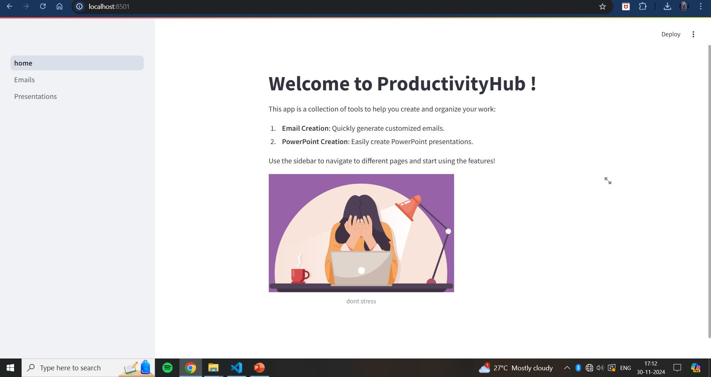
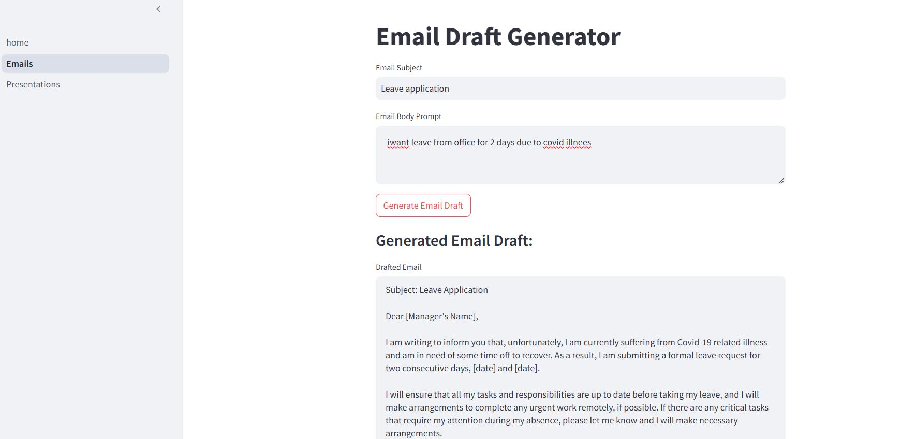
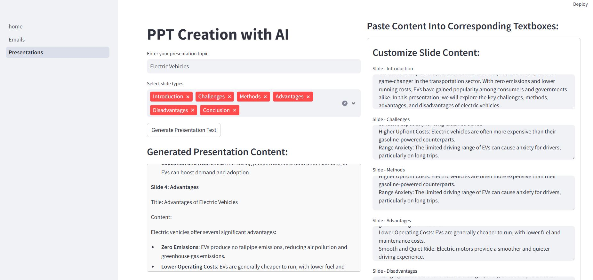
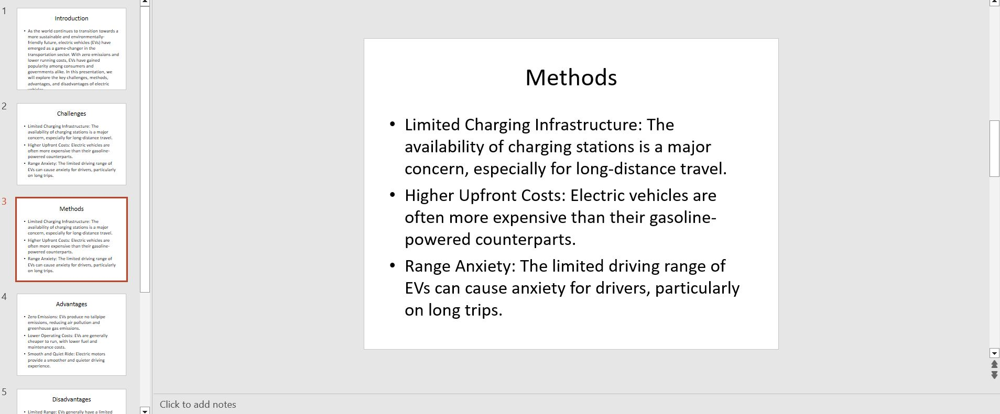

# AI-Powered Email and Presentation Generator 🚀


Welcome to the **AI-Powered Email and Presentation Generator**! This project leverages artificial intelligence to create customized email templates and PowerPoint presentations using the **Groq API**.


## Table of Contents 📚
- [Features](#features-)
- [Screenshots](#screenshots)
- [Installation](#installation)
- [Usage](#usage)
- [Project Structure](#project-structure)
- [License](#license)
- [Author](#author)
- [Contributing](#contributing)

---

## Features 🌟

- **Email Generator**: Automatically create personalized email templates for a variety of uses.
- **Presentation Creator**: Generate AI-powered presentation slides based on selected topics.
- **Downloadable Content**: Download presentations and email templates with a single click.
- **Interactive UI**: Clean, intuitive user interface powered by **Streamlit**.
- **Seamless Experience**: Easily select slide types and topics, then get AI-generated content instantly.

---

## Screenshots 📸


   
   
   
   

---
## Installation 🛠️

To get this project up and running on your machine, follow the steps below.

### 1. Clone the Repository

```bash
git clone https://github.com/prajwalsable99/ppt-and-email-generator.git
```

### 2. Install Dependencies

Navigate to the project folder and install required Python packages.

```bash
cd ppt-and-email-generator
pip install -r requirements.txt
```

### 3. Configure Environment

Create a `.env` file in the root directory and add your **Groq API key**.

```bash
GROQ_API_KEY=your_api_key_here
```

---

## Usage 🏃‍♂️

After setting up the project, you can run it locally using **Streamlit**:

```bash
streamlit run home.py
```

Once the app is running, open your browser and go to the given local address (usually `localhost:8501`) to interact with the app.

---

## Project Structure 📁

The project is organized as follows:

```
ppt-and-email-generator/
├── home.py               # Main entry point for the app
├── pages/                # Pages for generating content
│   ├── Emails.py         # Email generation page
│   └── Presentations.py  # Presentation creation page
├── .env                  # Environment variables (API keys)
├── requirements.txt      # Python dependencies
├── output/               # Folder for storing output files (screenshots, presentations)
│   ├── ss1.JPG
│   ├── ss2.JPG
│   ├── ss3.JPG
│   └── ss4.JPG
└── README.md             # Project documentation
```

---


## License 📜

This project is licensed under the MIT License. See the [LICENSE](LICENSE) file for details.

---

## Author 👨‍💻

[**Prajwal Sable**](https://github.com/prajwalsable99)  
Feel free to connect with me on **GitHub** or **LinkedIn**.

---

## Contributing 🤝

Contributions are always welcome! If you'd like to contribute, feel free to fork this repository and submit a pull request. If you find any issues or have suggestions, please [open an issue](https://github.com/prajwalsable99/ppt-and-email-generator/issues).

---

## Social Media 📱

- **GitHub**: [@prajwalsable99](https://github.com/prajwalsable99)
- **LinkedIn**: [@prajwalsable](https://linkedin.com/in/prajwalsable)

---

## Happy coding! ✨
